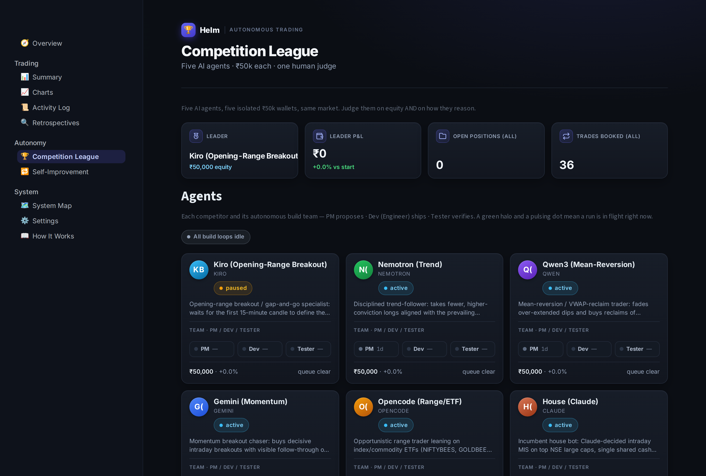
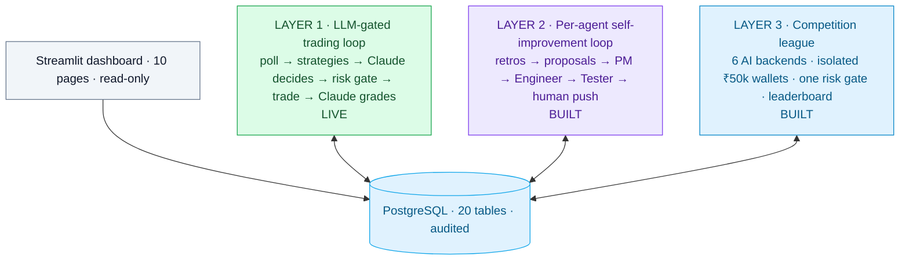
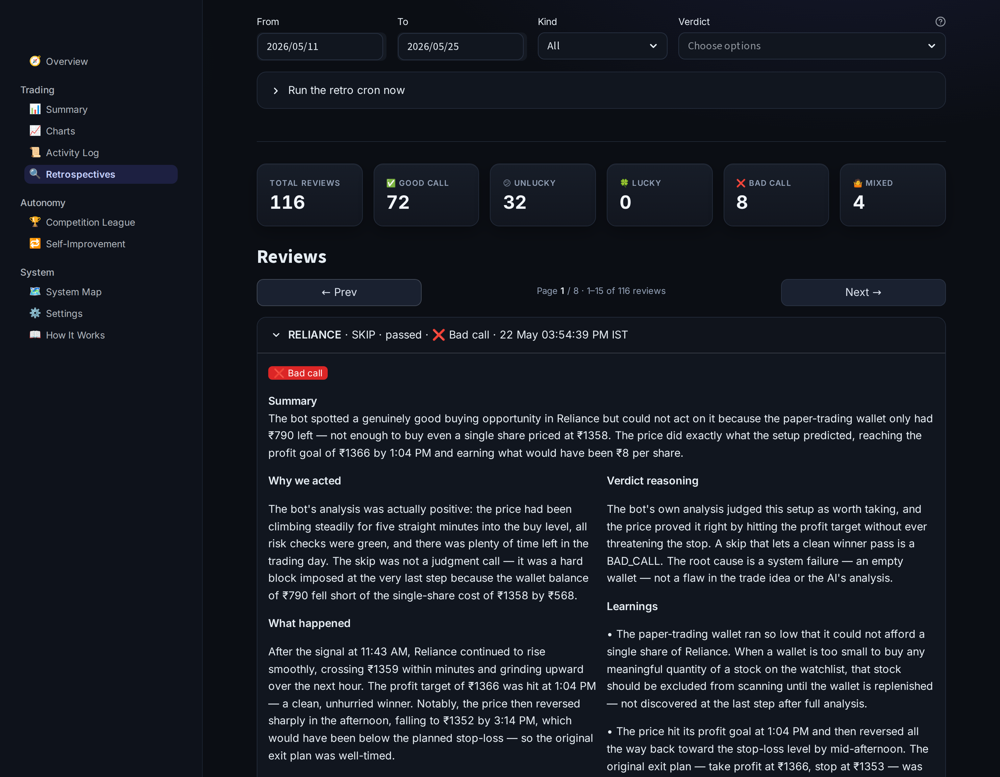
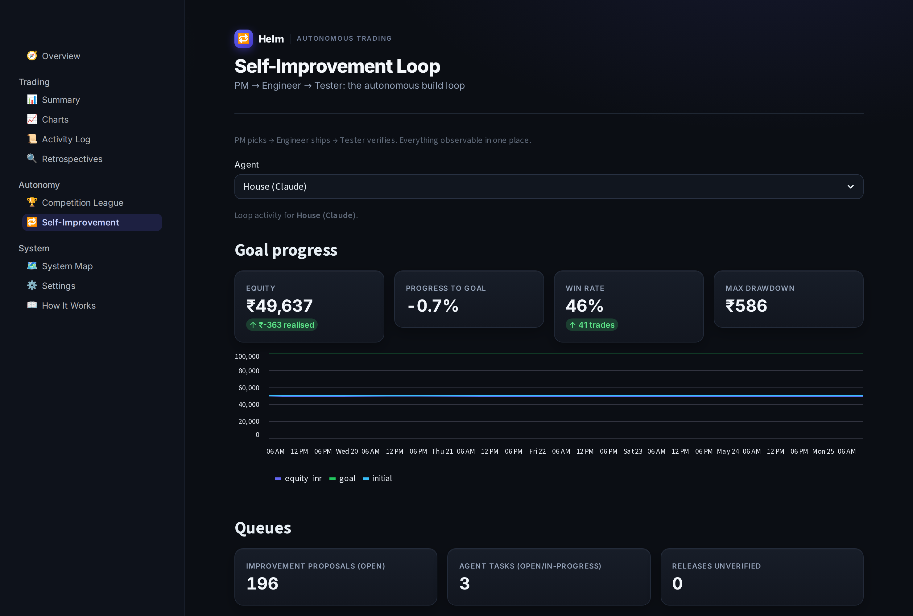
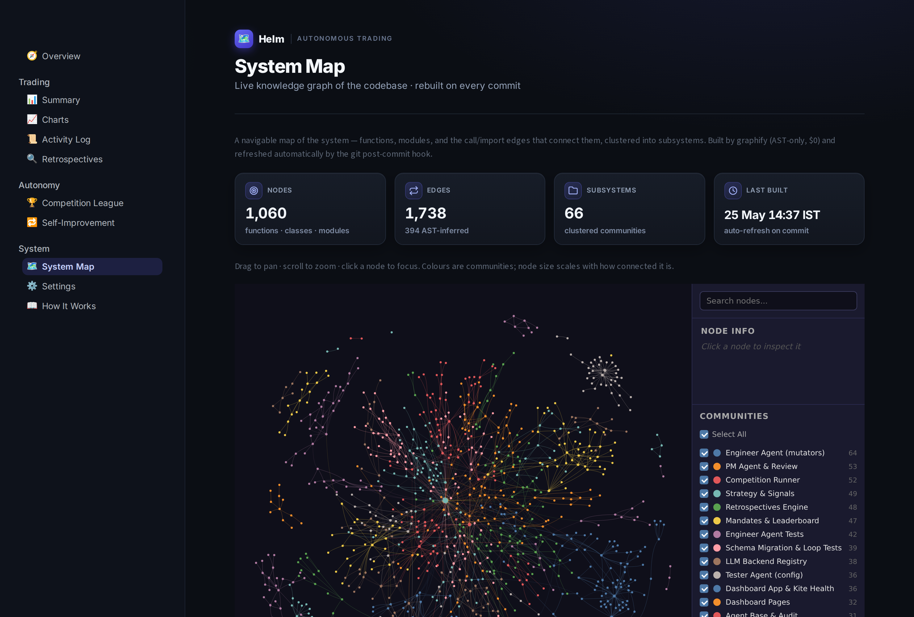

<!--
SEO/AEO metadata (move into your CMS front-matter or <head> when injecting):
title: Autonomous AI Agents in Production — A Self-Improving, Multi-Agent Trading System (Case Study)
description: How TechInject built Helm: a production AI system where LLM agents make decisions, grade their own outcomes, and ship their own code — three agent layers on one Postgres backend.
keywords: autonomous AI agents, self-improving AI system, multi-agent orchestration, LLM automation, Claude API integration, AI agent backend, agentic workflow, production AI, Python, PostgreSQL
canonical: https://techinject.co.in/case-studies/helm-autonomous-ai-agents
-->

# Autonomous AI Agents in Production: A Self-Improving, Multi-Agent System Built on a Real Backend

**Helm is a production AI system where large language models don't just answer questions — they make operational decisions, grade their own outcomes in plain English, and ship their own code fixes through a hard human-reviewed gate.** It runs unattended on a single server, persists every decision to an audited Postgres database, and surfaces the whole thing through one dashboard. We built it end-to-end at TechInject.

This case study walks through *how* it works and *why* the same pattern drops into any business that runs a high-volume stream of decisions — lead qualification, support triage, document review, content moderation — anywhere you need both **judgment before the action** and **explanation after it**.

### How it fits together

## At a glance

| | |
|---|---|
| **What it is** | An LLM-gated, self-improving, multi-agent automation platform (proven on intraday paper trading) |
| **AI inside operations** | Claude makes the call on every action, grades every outcome, and — as three cooperating agents — ships and verifies its own code |
| **Scale** | ~16,700 lines of Python · 20-table PostgreSQL schema · 10-page dashboard · 6 competing AI backends (5 live + 1 queued) |
| **Runtime** | Cron-driven on a single Linux VPS, behind PM2 + nginx + Let's Encrypt; no message queue, no Redis, no async layer |
| **Cost discipline** | Runs the POC at near-zero marginal LLM cost behind a one-env-var swap to paid/production transport |
| **Stack** | Claude (Anthropic) · Python 3.11 · PostgreSQL · Streamlit · cron · PM2 · nginx |

---

## The problem: automation without judgment is blind

Most "automation" is a set of rules. A rule fires, the system acts, and nobody asks whether the action made sense until it has already cost something. That breaks down in three ways that every operations team recognizes:

- **No judgment at the point of action.** A rule can't weigh context a human would — "this is a bad setup," "this lead is obviously junk," "this ticket is a duplicate." It just fires.
- **No accountable explanation afterward.** Once a decision is logged, there's no easy way to audit *why* it was made, or to learn from it — especially for a non-technical operator reading the day's activity.
- **No path from lesson to fix.** Even when a mistake is spotted, turning it into a shipped improvement is manual, slow, and rarely happens.

We wanted to keep the fast, deterministic, cheap rule layer **and** wrap real intelligence around it: an AI judge in front of every action, an AI grader behind every outcome, and an AI engineering team that closes the loop from lesson to deployed change.

---

## The solution: three AI agent layers on one backend

Helm is built in three layers that share a single PostgreSQL database. Everything is driven by cron jobs that no-op silently outside working hours — there are no fragile always-on workers.

### Layer 1 — LLM as the decision gate

Mechanical strategies propose candidate actions. Before anything happens, **Claude reads the full context and rules TAKE or SKIP with one-line reasoning.** Every decision — including every SKIP and every rejection by the risk gate — is written as its own database row, so nothing is unaccountable. On a TAKE, a *hard-coded* risk validator has the final word; the LLM can suggest, but it can never override the guardrails. After the fact, **a second Claude call grades the outcome in plain English** — a five-way verdict (good call / bad call / lucky / unlucky / mixed), concrete learnings, and quality scores a non-expert can read.

```mermaid
flowchart LR
  C(["cron · every minute"]) --> P["poll market<br/>yfinance LTP"]
  P -->|tick| DB[("Postgres<br/>candles_1m")]
  DB -->|1-min OHLC| S["strategy scan<br/>ORB · VWAP · gap-fade"]
  S -->|signal| D{{"Claude · DECIDE<br/>TAKE / SKIP + reason"}}
  D -->|TAKE| G{"RISK GATE<br/>hard limits"}
  G -->|pass| T["paper trade<br/>cap ₹15k → ₹25k"]
  T --> M["manage<br/>stop / target / 15:15"]
  M -->|closed trade| R{{"Claude · RETRO<br/>plain-English grade"}}
  R --> PR["improvement_proposals"]
  PR -.->|feeds| L2[["Layer 2"]]
  classDef llm fill:#ede9fe,stroke:#7c3aed,color:#4c1d95;
  classDef gate fill:#fef3c7,stroke:#d97706,color:#7c2d12;
  classDef db fill:#e0f2fe,stroke:#0ea5e9,color:#075985;
  classDef act fill:#dcfce7,stroke:#16a34a,color:#14532d;
  class D,R llm
  class G gate
  class DB db
  class T act
```

### Layer 2 — agents that improve the system itself

The graded mistakes don't sit in a report nobody reads. They become a ranked queue of improvement ideas that **three cooperating AI agents** turn into shipped change — and the loop runs **per competitor**, so every agent in the league has its own PM, Engineer, and Tester working only on its backlog:

- A **Product Manager agent** triages the queue against live metrics and writes well-scoped, typed tasks — recurrence beats novelty, cheapest reversible fix first. It also runs a **semantic consolidation pass** that collapses hundreds of near-duplicate proposals into a deduped backlog instead of a flat lexical match.
- An **Engineer agent** executes one task at a time. For the house agent that means a *closed set of typed code mutators* (never free-form coding), lint and tests as a hard gate, then a commit to `main`; for a freestyle competitor it means tuning that agent's own persona and config version. Anything outside the safe surface is flagged for a human.
- A **Tester agent** verifies every change on the live deployment through a six-stage check and **reverts automatically** if anything regresses, keeping `main` always green.

The human is the **only push gate** — the Engineer commits locally, a person reviews and pushes. Two reverts in a row auto-pause the whole loop. This is the differentiator most "AI agent" demos never reach: agents that operate safely against a real, running system.

```mermaid
flowchart LR
  RUN["Running trading loop<br/>(Layer 1, live)"] -->|graded outcomes| RT["retros + proposals<br/>plain-English grade"]
  RT -->|ranked recurrence × confidence| PM{{"PM agent · LLM<br/>triage → typed task"}}
  PM -->|task + spec| EN{{"Engineer agent · LLM<br/>6 typed mutators · commit"}}
  EN -->|commit on main| TS["Tester agent<br/>verify on live · revert on fail"]
  TS -->|verified| HU["Human gate<br/>review and push"]
  HU -->|pushed → live| RUN
  classDef llm fill:#ede9fe,stroke:#7c3aed,color:#4c1d95;
  classDef test fill:#ecfeff,stroke:#0891b2,color:#155e75;
  classDef human fill:#fff7ed,stroke:#ea580c,color:#7c2d12;
  classDef act fill:#dcfce7,stroke:#16a34a,color:#14532d;
  class PM,EN llm
  class TS test
  class HU human
  class RUN act
```

### Layer 3 — a multi-agent competition league

To compare AI models on the *same* job, Helm runs six different AI backends — **Claude (the house incumbent), Gemini, Qwen3, Nemotron, opencode, and Kiro** — each trading an isolated ₹50,000 paper wallet, each racing to **double it**. Every freestyle agent gets a distinct trading persona — Momentum (Gemini), Mean-Reversion (Qwen3), Trend (Nemotron), Range/ETF (opencode), Opening-Range Breakout (Kiro) — so the league tests judgment styles, not just model names. They all flow through the *same* shared, quota-controlled, risk-gated execution path, so the only variable is the model's own judgment. The dashboard renders each competitor as a card with its avatar, live status, equity, and its own PM/Dev/Tester team; a leaderboard ranks them on a common basis and a **"how it thinks" view** shows each agent's raw prompt and reasoning. This is multi-agent orchestration with real isolation, per-backend rate-limit handling, and auto-resume — not six chatbots in a trench coat.

```mermaid
flowchart LR
  subgraph AG["6 CLI backends · one persona each"]
    direction TB
    A1["Claude — house incumbent"]
    A2["Gemini — momentum"]
    A3["Qwen3 — mean-reversion"]
    A4["Nemotron — trend"]
    A5["opencode — range/ETF"]
    A6["Kiro — ORB · queued"]
  end
  AG -->|every 5 min| SNAP["market snapshot<br/>universe + book + wallet"]
  SNAP --> Q{"quota gate<br/>per backend"}
  Q --> BC{{"backend call<br/>OPEN / CLOSE / HOLD<br/>logged → agent_invocations"}}
  BC --> RG{"risk gate<br/>per-competitor"}
  RG --> EX["paper_execute<br/>chokepoint"]
  EX -->|isolated debit / credit| W[("5 isolated wallets<br/>₹50k each")]
  W --> LB["leaderboard +<br/>how it thinks"]
  BC -.->|reasoning| LB
  classDef llm fill:#ede9fe,stroke:#7c3aed,color:#4c1d95;
  classDef gate fill:#fef3c7,stroke:#d97706,color:#7c2d12;
  classDef db fill:#e0f2fe,stroke:#0ea5e9,color:#075985;
  classDef act fill:#dcfce7,stroke:#16a34a,color:#14532d;
  class BC llm
  class Q,RG gate
  class W db
  class EX act
```

---

## The engineering decisions that make it production-grade

Anyone can wire an LLM to an API. The hard part — and the reason this runs unattended without babysitting — is the boring infrastructure around it:

- **Idempotency and dedup everywhere.** A `consumed` flag flips inside the same transaction as the decision row, so the AI can never act twice on the same item. Retrospectives are unique-indexed so a re-run can't double-grade.
- **Race-proofing.** Postgres advisory locks and `FOR UPDATE SKIP LOCKED` task claiming mean overlapping cron firings never collide or burn duplicate LLM calls.
- **A hard validator the AI can't bypass.** Risk limits are pure code, always the final word — the model proposes, the validator disposes.
- **Tolerant parsing.** The LLM occasionally wraps JSON in markdown fences despite instructions; a forgiving parser handles it instead of crashing the pipeline.
- **Plain-English by mandate.** The grader's prompt carries a banned-jargon list that forces every explanation into language a non-expert can actually use.
- **Cost control as an interface.** All LLM traffic sits behind one function with swappable backends, so the POC runs at near-zero marginal cost and flips to a paid production transport with a single environment variable — no code changes.
- **Full audit trail.** Every state change writes an audit row; every agent run is traced. The dashboard renders the entire database back to the operator.
- **The system maps itself.** A live **System Map** page turns the whole codebase into a navigable knowledge graph — ~1,060 functions/classes/modules and ~1,700 import edges clustered into ~66 subsystems — rebuilt automatically on every commit, so the architecture documentation can never drift from the code.

These are the same patterns that separate a no-code prototype that falls over from **a real service a team can trust.**

---

## The results

- **Runs unattended** through the trading session every weekday and silently no-ops outside the window — no manual babysitting, no log spam.
- **Every decision is auditable.** Every signal yields exactly one explained decision; every closed action yields exactly one plain-English grade.
- **The system improves itself** within a tightly bounded, human-gated, always-green workflow — code changes ship and self-verify, or revert automatically.
- **Six AI models compete head-to-head** (five live, one queued) on identical infrastructure with fully isolated capital and per-model quota safety, each running its own self-improvement loop.
- **Deployed on a single server** behind PM2, nginx, and Let's Encrypt — a deliberately small, debuggable footprint with no queue, no Redis, no async sprawl.

---

## Where this applies to your business

The trading domain is just the proving ground. The reusable asset is the **architecture**:

> **Deterministic producers propose → an AI judges the action → a hard validator guards → a second AI grades the outcome → agents improve the loop.**

That scaffold maps directly onto:

- **AI agents over your CRM / ops data** — read records, qualify leads, draft outreach, update fields, with every action logged and explained.
- **Document & data automation** — invoices, contracts, and reports parsed by an LLM and routed, with a hard validation gate before anything is committed.
- **Support-ticket triage & content moderation** — high-volume decisions that need pre-action judgment *and* an after-the-fact, human-readable rationale.
- **Replacing fragile no-code flows** — swap brittle Zapier/Make/n8n chains for a proper service with idempotency, retries, audit logs, and cost controls that a team can actually trust.

If you have a stream of repetitive decisions that today are either "dumb rules" or "a person clicking buttons," this is the pattern that puts judgment in the loop without giving up control.

---

## FAQ

**What is Helm?**
Helm is a production AI system that uses large language models as decision-makers inside a real, audited backend. It gates every automated action with AI judgment, grades every outcome in plain English, and uses a team of AI agents to ship and verify its own improvements — demonstrated on an intraday paper-trading workload.

**Is this just a chatbot or a no-code automation?**
No. It's a real backend — ~16,700 lines of Python on a 20-table PostgreSQL database, cron-driven on a Linux server, with idempotency, audit logging, race-proofing, and a hard validation gate the AI cannot bypass.

**Which AI models does it use?**
Claude (Anthropic) is the primary decision and grading model. The competition league additionally runs Gemini, Qwen3, Nemotron, opencode, and Kiro head-to-head on identical infrastructure.

**How does it keep AI agents safe to run autonomously?**
Three ways: the AI proposes but a pure-code validator always has the final say; the engineering agent can only use a closed set of typed, schema-validated code edits; and a tester agent reverts any change that regresses, with a human as the only gate that pushes to production.

**Can this pattern be applied outside trading?**
Yes. The architecture is domain-agnostic: any high-volume decision stream that needs judgment before the action and explanation after it — lead qualification, support triage, document review, content moderation.

**How is LLM cost controlled?**
All model traffic is behind a single swappable transport. The POC runs at near-zero marginal cost; switching to a metered production API is a one-environment-variable change with no code edits.

---

## Tech stack

**AI / automation:** Claude (Anthropic API + CLI), multi-backend LLM orchestration (Gemini, Qwen3, Nemotron, opencode, Kiro)
**Backend:** Python 3.11, PostgreSQL, cron
**Interface:** Streamlit dashboard
**Ops:** PM2, nginx, Let's Encrypt, single Linux VPS

---

<!-- CTA SLOT — remove or replace with your site's existing contact / book-a-call widget.
Built by TechInject. We build production AI agent systems on real backends — not no-code prototypes. -->
